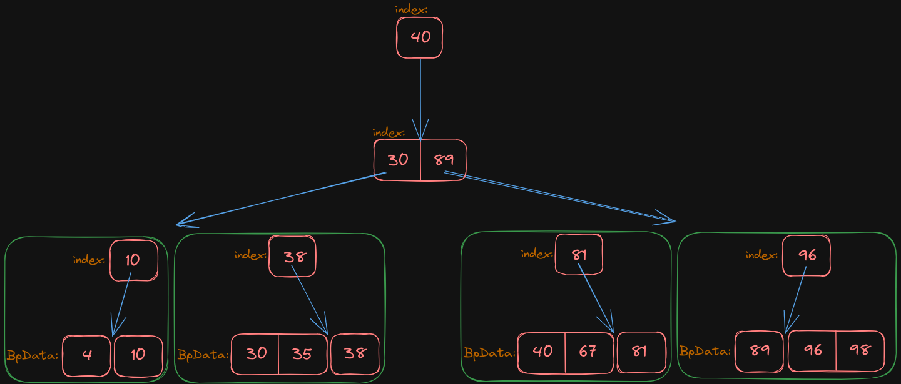

# B Plus Tree

## Operations on Data Nodes

## Operations on Index Nodes

### Split and merge with BpData

> When splitting and merging at the **bottom-level** index node here, **BpData will be split along with it**.

#### splitWithDnode

Split the bottom-level Index Node

```go
func (inode *BpIndex) splitWithDnode() (key int64, side *BpIndex, err error)
func Test_Check_inode_splitWithDnode(t *testing.T)
```

Before the function is executed:

This is a 3-node B+ tree. A new independent node is allocated with 2 data node slices, starting from position pos2. 
A total of 2 data nodes are cut out, [40] and [81, 98].

Similarly, the index is also cut starting from pos2, resulting in a single index, 81. Therefore, the entire program is correct.

(重点就是同时用 Pos 这个位置去切割 index 切片和 BpData 切片都不会有错误)


After the function is executed:

**function splitWithDnode** will divide the index node into three parts:

- the old index node (named **inode**)
- the new key (named **key**)
- the new index node (named **side**)

and then reassemble them afterward.


####  mergeWithDnode

Combines split index nodes into a new node, overwriting the original inode's address.

```go
func (inode *BpIndex) mergeWithDnode(podKey int64, side *BpIndex) error
func Test_Check_inode_mergeWithDnode(t *testing.T)
```

To merge these three components

- the old index node (named **inode**)
- the new key (named **key**)
- and the new index node (named **side**)

into a new index node using **function mergeWithDnode**.


### Protrude index node

protrudeInOddBpWidth performs index upgrade; when the middle value of the index slice pops out, it gets upgraded to the upper-level index.

```go
func (inode *BpIndex) protrudeInOddBpWidth() (middle *BpIndex, err error)
Test_Check_inode_protrudeInOddBpWidth(t *testing.T)
```

The initial index node was too large, and now a portion of the index node needs to be upgraded.


The upgraded result is as follows: index 40 has been upgraded to the upper-level node.



### Split and merge with upgraded key and node

#### mergeUpgradedKeyNode

Merges the to-be-upgraded Key and the to-be-upgraded Inode into the parent index node.

```go
func (inode *BpIndex) mergeUpgradedKeyNode(insertAfterPosition int, key int64, side *BpIndex) (err error)
// insertAfterPosition indicates where it should be inserted after.

func Test_Check_inode_mergeUpgradedKeyNode(t *testing.T)
```

Currently, three parts are going to be merged:

- index node 1 (the original index node)
- key 1 (the part of the index to be upgraded)
- and index node 2 (the index node to be upgraded)


The merged result is as follows.


#### insertAfterPosition parameter

insertAfterPosition indicates where it should be inserted after. (插在什么位置之后)

For example, if insertAfterPosition is at pos0(0), insert the upgraded node after pos0(0), which is at pos1(1). (传入0，在位置0之后，就是1)


