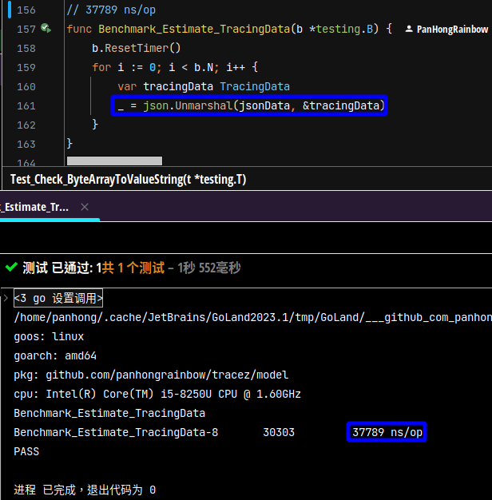
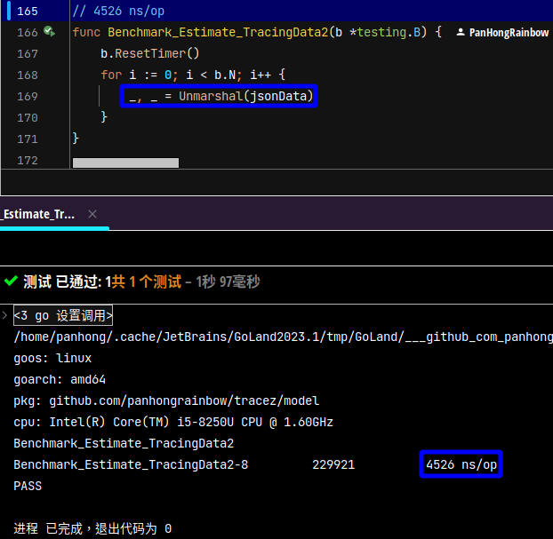

# Performance Enhancement

I have to come up with strategies to improve `the performance of TracingData`.

The explanations are listed below:

## Omit some Json fields 

The `TracingData data` is very `large`, but I found that if `some fields can be Omited` , the performance can be improved.

However, the original data needs to be backed up.

## Self-Written Parser

Performing benchmark testing in a desktop environment is actually troublesome.
It is because it makes the performance unstable.

(在桌面环境上，进行基准测试中，很不稳定啊，那还是做比较好了)

The best method is to do comparisons.

For JSON processing, `third-party packages` will be about twice as fast as standard packages, (快1倍)
and `Self-Written Parsers` will be about 6 to 7 times faster than benchmark packages.

(快6倍以上)
In `reality`, it was about `8.3 times faster`, which is an acceptable result. (最后实作出来是快 8.3 倍)

## Reality

In actual testing, the speed of `the JSON package` is `37,789 nanoseconds`, while the speed of `the self-written parser` is `4,526 nanoseconds`, which is `8.3 times faster`.

### In Json Package

 

### Self-Written Parser

 

## Summary

As for `the issue of omitting tracing fields`, I think it is `no longer important`, because `processing []Attribute is the most critical bottleneck`.

(`[]Attribute处厘` 比 `省略 Json栏位这问题` 重要)